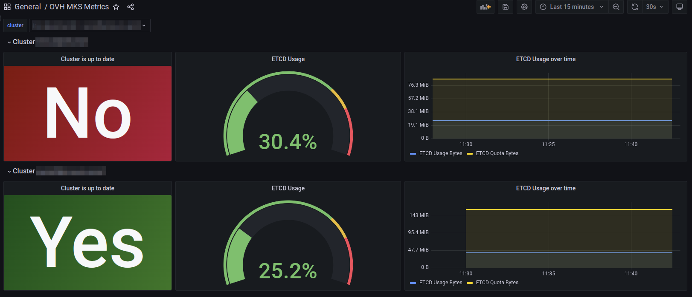

# OVH Prometheus Exporter for Managed Kubernetes Clusters.

[](https://github.com/rverchere/ovh-mks-exporter/actions/workflows/docker-publish.yml)
[](https://github.com/rverchere/ovh-mks-exporter/actions/workflows/go-releaser.yml)

[](https://hub.docker.com/r/rverchere/ovh-mks-exporter/)
[](https://hub.docker.com/r/rverchere/ovh-mks-exporter/)

⚠️ This is a work in progress project, and I'm learning GO langage with that simple small project. ⚠️

This exporter retrieves some information from the OVHcloud API, which are not handled directly with k8s internal metrics:
- etcd quota usage
- up-to-date cluster version (to check if a security/patch upgrade is available)
- general information of the clusters
- instances information of the clusters
- swift storage (objects and usage)

It retrieves metrics from all clusters and swift containers defined in a public cloud project.

This exporter is inspired by the https://github.com/enix/x509-certificate-exporter project, thanks to Enix team!

## Prerequisites

You must generate OVHcloud API token here : https://eu.api.ovh.com/createToken/

The application uses only environment variables:
- OVH_ENDPOINT (default to `ovh-eu`)
- OVH_APPLICATION_KEY
- OVH_APPLICATION_SECRET
- OVH_CONSUMER_KEY
- OVH_CLOUDPROJECT_SERVICENAME: the service name of the OVHcloud Public Cloud Project

## Installation

On a kubernetes environment, you have to:

1. Create a secret `
```
kubectl create secret generic ovh-mks-exporter \
    --from-literal=OVH_ENDPOINT=ovh-eu \
    --from-literal=OVH_APPLICATION_KEY=${OVH_APPLICATION_KEY} \
    --from-literal=OVH_APPLICATION_SECRET=${OVH_APPLICATION_SECRET} \
    --from-literal=OVH_CONSUMER_KEY=${OVH_CONSUMER_KEY} \
    --from-literal=OVH_CLOUDPROJECT_SERVICENAME=${OVH_CLOUDPROJECT_SERVICENAME}
``` 
2. Deploy application, service and servicemonitor using the helm chart in the `deployment`folder:
```
helm repo add ovh-mks-exporter https://rverchere.github.io/ovh-mks-exporter
helm repo update
helm upgrade --install ovh-mks-exporter ovh-mks-exporter/ovh-mks-exporter
```

The **servicemonitor** must be changed to match your prometheus installation (see `prometheusReleaseName`in the values file).

## Metrics

The following metrics are exported:

| Name | Description | Values |
|------|-------------|--------|
| ovh_mks_cloud_info | Public cloud projet information (id, name, description, status) | 1 |
| ovh_mks_cluster_info | Cluster information (id, name, region, status, etc) | 1 |
| ovh_mks_cluster_isuptodate | Cluster is up to date (patch/security version) | 0 (no), 1 (yes) |
| ovh_mks_etcd_usage_quota_bytes | ETCD quota  max usage | bytes |
| ovh_mks_etcd_usage_usage_bytes | ETCD current usage | bytes |
| ovh_mks_cluster_nodepool_info | Nodepool information (id, name, nodes number, nodes flavor, etc) | 1 |
| ovh_mks_cluster_instance_info | Instance information (id, name, billing) | 1 |
| ovh_storage_object_count | Swift container object count | count |
| ovh_storage_object_bytes | Swift container object usage | bytes |

## Example




